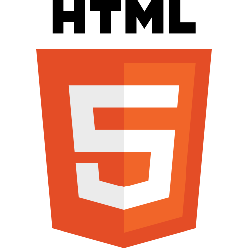

!SLIDE incremental center

!SLIDE incremental
# HTML

- born in 1990
- implementation of **SGML**
- blessed as **HTML4** in 1997
- ad-hoc
- fault-tolerant
  - e.g. auto-close `<td>` if `</td>` isn't provided

!SLIDE incremental
# XHTML

- implementation of **XML**
    - valid **XHTML** == valid **XML**
- 1.0: 2000
- 1.1: 2001
- attempt @ standardization
- strict: parse error stops document processing

!SLIDE small incremental
# HTML5: Living Standard

- *The concept of a living standard is that it is never complete and is always being updated and improved* - [en.wikipedia.org/wiki/HTML5#Standardization_process](http://en.wikipedia.org/wiki/HTML5#Standardization_process)

- 

        @@@html
        <!doctype html>

- "moving target"

!SLIDE incremental
# HTML5
## supercedes:

- **HTML 4**
- **XHTML 1**
- **DOM** Level 2 **HTML**

!SLIDE incremental
# HTML5
## attempts to replace

- ad-hoc and non-standard APIs
- proprietary plugins
    - e.g. Adobe Flash

!SLIDE incremental
# HTML5 New Features
## media elements:

- `<video>`
- `<audio>`
- `<canvas>`
- SVG
- MathML

!SLIDE incremental
# HTML5 New Features
## semantic content identifiers

- `<section>`
- `<article>`
- `<header>`
- `<nav>`

- **DOM** now part of HTML spec

!SLIDE small incremental
# HTML5 New Features
## data- attributes

embed key-value data within **HTML** `<tags>`

    @@@html
    <a href="http://www.google.com"
       class="button"
       data-info="popular search engine"
    >Google</a>

    <a data-toggle='collapse'>Layer Controls</a>
    

!SLIDE center
# HTML5 New Features
## That's Not All, Folks...

!SLIDE smaller incremental
# HTML5 New Features
## More!

- Timed media playback
- Offline Web Applications
- Document editing
- Drag-and-drop
- Cross-document messaging
- Browser history management
- **MIME** type and protocol handler registration
- Microdata
- Web Storage

!SLIDE incremental small
# HTML5 media queries

query device display properties via **CSS3**
    
    @@@css
    @media (min-width:500px) { // css }
    @media (max-width:499px) { // narrow-screen css }
    @media (orientation: portrait) { // css }

<http://www.w3.org/TR/css3-mediaqueries/>

!SLIDE incremental
# HTML5: browser support

- not yet an official standard, so no browsers completely support all **HTML5** features

- supporting > 50% of current **HTML5** features:

    - Chome 6+
    - Firefox 10+
    - Safari 5+
    - Internet Explorer 10+
    - Mobile Safari (iOS) 4.2+
    - Android Browser: 3.0+

- by-feature support: <http://caniuse.com>

